# CubeLang

CubeLang is a strongly staticly typed domain-specific procedural programming language made for solving twisting cube puzzles like Rubik's cubes.

## Examples

There are two exampe programs written in CubeLang. They are located in the `exemples` directory of this repository. 

The results of executing example programs are shown bellow.

**Beginner's method** (3x3x3 cube) @ [examples/beginner](examples/beginner)

| [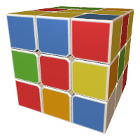](https://www.youtube.com/watch?v=dzqH6hYKuco) | [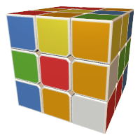](https://www.youtube.com/watch?v=7hDjaBIfIeU) | [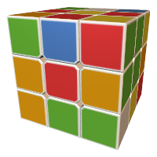](https://www.youtube.com/watch?v=-jjZ7OJNd4g) | [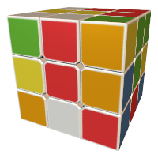](https://www.youtube.com/watch?v=_PxvFn2qd5M) | [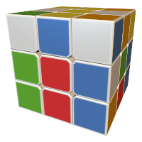](https://www.youtube.com/watch?v=D6EbnLoh51s) | [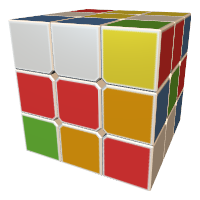](https://www.youtube.com/watch?v=NhziEe3avvM)
|--|--|--|--|--|--|

**Pocket cube** (2x2x2 cube) @ [examples/pocket-cube](examples/pocket-cube)

| [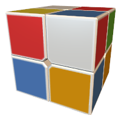](https://www.youtube.com/watch?v=NhziEe3avvM) | [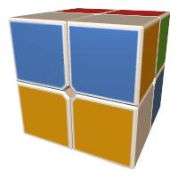](https://www.youtube.com/watch?v=z7OPzDXNGSA) | [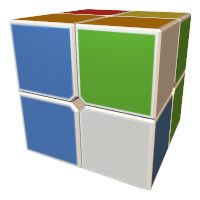](https://www.youtube.com/watch?v=MO36Aj56TVw) | [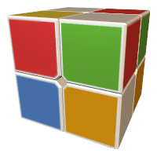](https://www.youtube.com/watch?v=ZX0P7-SvCWod5M) | [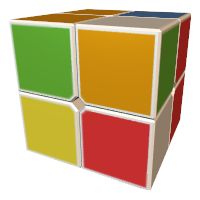](https://www.youtube.com/watch?v=an4ovEBPumc) | [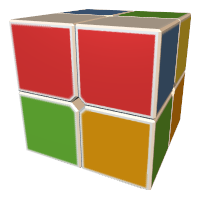](https://www.youtube.com/watch?v=Qvmfpi6yIWQ)
|--|--|--|--|--|--|

## Documentation

You can find the language documentation in the [`docs`](./docs) directory in the root of this repositorty.

Documentation constists of the following sections:

**Usage** @ [docs/usage.md](./docs/usage.md) Describes the command line arguments for the interpreter and scrambler utility application

**Variables and types** @ [docs/types.md](./docs/types.md)   Describes how to define a variable, determine it's scope. Lists data types, supported by CubeLang.

**Operators** @ [docs/operators.md](./docs/operators.md)   Lists binary and unary operators supported by CubeLang.

**Conditions and loops** @ [docs/statements.md](./docs/statements.md)   Shows the syntax of most execution controlling operators: conditions, loops and `orient` operator.

**Cube turns and rotations** @ [docs/actions.md](./docs/actions.md)   Shows the syntax of cube turning and rotating commands used by the language and some of the interpreter's command line arguments.

**Indexing** @ [docs/indexing.md](./docs/indexing.md)   Describes how to access sticker colors of a cube.

**Standard library** @ [docs/stdlib.md](/docs/stdlib.md)   A reference for all functions and constants included into the standard library.

## License

This software is licensed under MIT license. Please refer to [LICENSE](./LICENSE) file for more information.

Copyright &copy; Vlad Poletaev, 2019