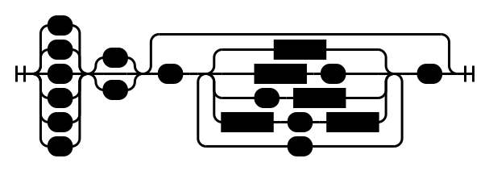

# Cube turns and rotations

During the execution of the CubeLang program, the state of the cube is simulated. The state includes colors of all the stickers and the current orientation of the cube.

CubeLang implements turn and rotation notation that is widely used in the speedcubing community. The turning notation for the larger cubes is different from the commonly used but more flexible.

## Cube turns
All turns and rotations are executed using special commands: `R`, `L`, `U`, `D`, `F`, `B`. When one of these commands is executed the right, left, top, bottom, front or back face will be rotated clockwise respectively. If the face needs to be rotated counterclockwise a user may use one of two modifiers. A `'` symbol is used to reverse the rotation direction. A `2` symbol doubles the angle.

These operations are enough to solve 3&times;3&times;3 or 2&times;2&times;2 twisting cube puzzle, but not cubes of higher dimensions as it is not possible to rotate slices located in the middle. CubeLang uses extended notation for these purposes.

In the square brackets, one-based indices or ranges of indices can be specified. These indices determine what slices will be turned. Slices are numbered starting with one (the slice that would have been rotated if the index weren't specified).

|  |  |  |
|:-----------:|:-------------:|:------------:|
| `F[2]`      |  `R[2]`       | `U[2]`       |
|  |  |  |
| `B[2]`      |  `L[2]`       | `D[2]`       |

A user can use ranges of indices instead of specifying multiple indices. These ranges can be open and closed. The closed range such as `[2:5]` references all slices with indices from 2 to 5 inclusive. It is equivalent to writing `[2, 3, 4, 5]`. Open ranges do not specify one of the boundaries. Writing `[:3]` would produce the same result as writing `[1, 2, 3]`. Writing `[3:]` would produce the same result as `[3, 4, …, N]` where *N* is the dimension of the cube (Note that `[3, 4, …, N]` is not a valid syntax; for *N* = 5 the range may be written as `[3, 4, 5]`).

|            |
|:---------------------------------------:|
| `L[:2, 5:6, 8:]` *or* `R'[:2, 4:5, 8:]` |

## Rotations

Three commands cause orientation change: `X`, `Y` and `Z`. These commands perform clockwise rotation around right, top and front faces respectively. `'` and `2` can be added to reverse direction or double the angle of the rotation.

These commands follow the standard notation, common in the speedcubing community.
