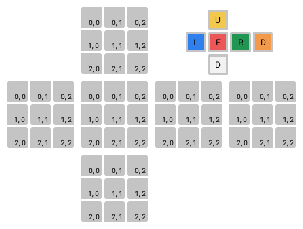

# Indexing

cubelang allows users to access the colors of cube stickers. The syntax is similar to accessing the element of the list but two indices are used: a 0-based index of a row and a 0-based index of a column: 

An index of any particular sticker may change depending on the orientation of the cube. Stickers on the front face follow intuitive indexing: rows are numbered from top to bottom, columns: from left to right. The left, back and right side indicis work like as if the cube was rotated around Y axis so that this side was in front. The top and bottom sides follow the similar logic, but rotation is performed around X axis.

The following figure shows indexing of the 3x3x3 cube. Indexing of the stickers on a cube of higher dimension is similar.

